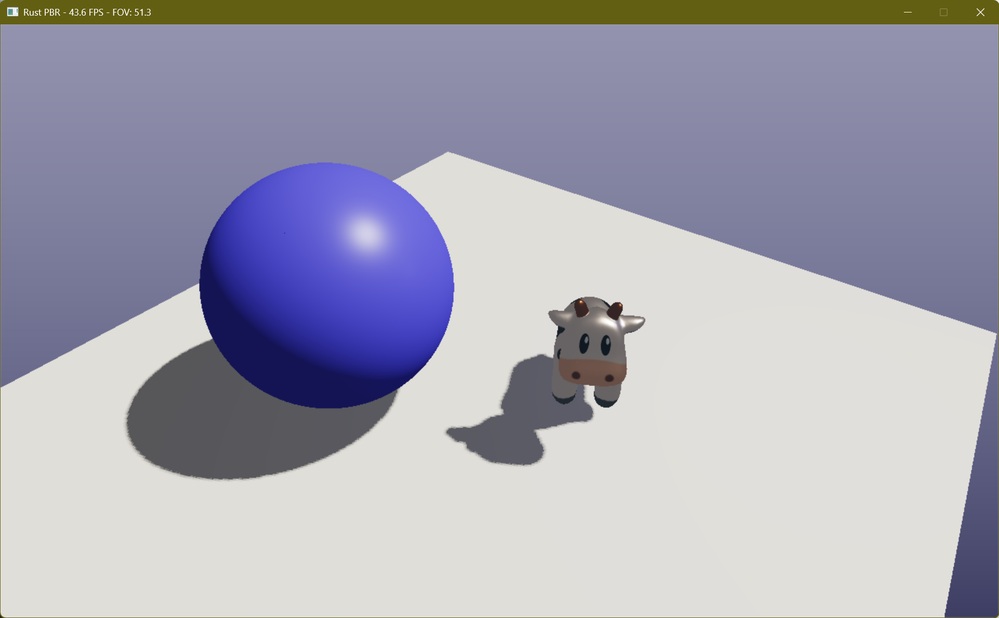

# Rust PBR Rasterizer

A high-performance, multi-threaded software rasterizer written from scratch in Rust. This project implements a modern
programmable pipeline featuring Physically Based Rendering (PBR) and a flexible dual-mode architecture: high-quality
offline rendering via CLI and interactive real-time visualization via **minifb**.

> - gLTF support is work-in-progress. Currently, only Wavefront OBJ files with MTL materials are supported.
> - Tile-based rendering and additional optimizations are planned for future releases.

[](https://deepwiki.com/Rukkhadevata123/rasterizer-rust)

High-quality offline rendering:


We can modify the scene interactively in real-time:



## Key Features

### Interactive Real-time GUI

- **Windowing:** Lightweight window management using `minifb`.
- **Camera Control:** FPS-style free-roam camera (WASD movement, mouse look, FOV zoom).
- **Hot Reloading:** Instant feedback loop — press 'R' to reload scene configuration (lights, materials, transforms)
  without restarting.
- **Runtime Toggles:** Switch cull modes and wireframe rendering on the fly.
- **Performance:** Optimized display buffer handling with parallelized post-processing.

### Physically Based Rendering (PBR)

- **Workflow:** Metallic-Roughness workflow.
- **BRDF:** Cook-Torrance model with Trowbridge-Reitz GGX Normal Distribution.
- **Detailing:** **Normal Mapping** with automatic Tangent Space generation (MikkTSpace-like algorithm with Gram-Schmidt
  orthogonalization).
- **Optics:** Smith Geometry function & Fresnel-Schlick approximation.
- **Color Correctness:** Proper Linear/sRGB color space handling for textures and output.

### Shadow System

- **Two-pass Rendering:** Depth-only pass for shadow maps → Main lighting pass.
- **Soft Shadows:** PCF (Percentage Closer Filtering) with configurable kernel size.
- **Bias Control:** Configurable shadow bias to prevent acne/peter-panning.

### High Performance

- **Parallel Rendering:** Massive parallelism using `Rayon` for triangle rasterization, fragment shading, and
  post-processing.
- **Thread Safety:** Custom `FrameBuffer` utilizing atomic depth buffers and striped locking for concurrent color
  writing.
- **Optimization:** Memory reuse strategies to minimize allocation during real-time render loops.

### Pipeline & Post-Processing

- **Programmable Shaders:** Trait-based Vertex and Fragment stages.
- **Interpolation:** Perspective-correct barycentric interpolation.
- **Anti-Aliasing:** SSAA (Super-Sample Anti-Aliasing).
- **Tone Mapping:** ACES Filmic Tone Mapping.

  - **Texture LOD (Mipmap):** Optional triangle-level mipmap LOD and trilinear filtering to reduce distant texture aliasing.

## Rendering Flow

1. **Configuration:** Scene data (camera, lights, objects, materials) is loaded from `scene.toml`.
2. **Shadow Pass:** The scene is rendered from the light's perspective into a depth buffer.
3. **Main Pass:**
    - **Vertex Shader:** Transforms vertices to Clip Space; generates varyings (World Pos, Normal, Tangent, UV).
    - **Clipping (Sutherland–Hodgman):** We clip primitives in homogeneous clip space (±X ≤ W, ±Y ≤ W, ±Z ≤ W) before the perspective divide to keep interpolation linear. Edge intersections are computed and attributes are linearly interpolated; the resulting convex polygon is then triangulated and rasterized.
    - **Rasterization:** Parallelized scanline conversion.
    - **Fragment Shader:** Constructs the **TBN Matrix**, samples PBR textures, and calculates lighting.
4. **Post-Processing:**
    - **GUI Mode:** Parallel tone-mapping and buffer conversion for window display.
    - **CLI Mode:** Tone-mapping and encoding to PNG.

## Controls (GUI Mode)

| Input                  | Action                                  |
|:-----------------------|:----------------------------------------|
| **W / A / S / D**      | Move Camera (Forward/Left/Back/Right)   |
| **Space / L-Shift**    | Move Up / Down (Elevation)              |
| **Left Mouse (Hold)** | Look Around (Yaw/Pitch)                 |
| **Scroll Wheel**       | Adjust FOV (Zoom)                       |
| **R**                  | Reload Configuration (Hot Reload)       |
| **Right Click**         | Cycle Cull Mode (Back -> None -> Front) |
| **Middle Click**       | Toggle Wireframe Mode                   |
| **Z**                  | Freeze Movement                         |
| **ESC**                | Exit                                    |

## Project Structure

```text
src
├── app.rs             # Application control loops (GUI & CLI logic)
├── core               # Core engine primitives
│   ├── framebuffer.rs # Thread-safe buffer with Atomics
│   ├── geometry.rs    # Vertex and geometric definitions
│   ├── math           # Linear algebra, interpolation, transform factories
│   └── rasterizer.rs  # Triangle rasterization logic
├── io                 # Input/Output
│   ├── config.rs      # TOML configuration parsing
│   ├── image.rs       # Image saving utilities
│   └── obj_loader.rs  # OBJ/MTL loading, Tangent calculation
├── pipeline           # Rendering pipeline
│   ├── passes.rs      # High-level render pass logic (Shadow & Main)
│   ├── renderer.rs    # Low-level render orchestration
│   └── shaders        # Programmable shaders (PBR, Shadow)
├── scene              # Scene graph data
│   ├── camera.rs      # Perspective & Orthographic cameras
│   ├── context.rs     # Container for scene resources
│   ├── light.rs       # Directional & Point lights
│   ├── loader.rs      # Resource loading and Hot-Reload logic
│   ├── material.rs    # PBR Material definitions
│   └── model.rs       # Mesh and Model containers
├── ui                 # User Interface & Input
│   └── input.rs       # Camera controller and input handling
└── main.rs            # Entry point and Argument parsing
```

## Usage

**1. Real-time GUI Mode (Recommended for quick previews)**
Explore the scene interactively and tweak materials in real-time.

```bash
cargo run --release -- --config scene.toml --gui
```

**2. Headless CLI Mode (Offline Rendering)**
Render a single high-quality frame to disk (default).

```bash
cargo run --release -- --config scene.toml
```
