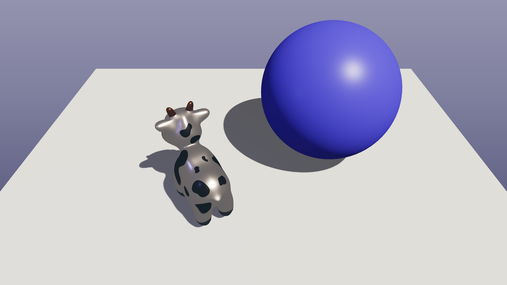

# Rust PBR Rasterizer

A high-performance, multi-threaded software rasterizer written from scratch in Rust. This project implements a modern programmable pipeline with Physically Based Rendering (PBR).

[](https://deepwiki.com/Rukkhadevata123/rasterizer-rust)



> **Note:** A real-time GUI using `egui` is currently **Work In Progress**. The renderer currently operates in headless mode via CLI configuration.

## Key Features & Advanced Concepts

* **Physically Based Rendering (PBR):**
  * Cook-Torrance BRDF model.
  * Metallic-Roughness workflow.
  * Trowbridge-Reitz GGX Normal Distribution.
  * Smith Geometry function & Fresnel-Schlick approximation.
* **Shadow System:**
  * Two-pass rendering (Shadow Map generation -> Main Render).
  * **PCF (Percentage Closer Filtering)** for soft shadows.
  * Configurable bias and kernel size.
* **High Performance:**
  * **Parallel Rendering:** Uses `Rayon` for multi-threaded triangle rasterization and pixel shading.
  * **Thread Safety:** Custom `FrameBuffer` with atomic depth buffers and striped locking for color data.
* **Pipeline:**
  * Programmable Shader traits (Vertex & Fragment stages).
  * Perspective-correct interpolation.
  * Back-face culling and wireframe modes.
  * **SSAA** (Super-Sample Anti-Aliasing).
* **Post-Processing:**
  * ACES Filmic Tone Mapping.
  * Linear-to-sRGB Gamma Correction.

## Rendering Flow

1. **Configuration:** Scene data (camera, lights, objects, materials) is loaded from `scene.toml`.
2. **Shadow Pass:** The scene is rendered from the light's perspective into a depth buffer (Shadow Map).
3. **Main Pass:**
    * **Vertex Shader:** Transforms vertices to Clip Space; generates varyings (World Pos, Normal, UV).
    * **Rasterization:** Parallelized scanline conversion with barycentric interpolation.
    * **Fragment Shader:** Calculates PBR lighting (Direct + Ambient) and applies shadows.
4. **Post-Processing:** HDR color values are tone-mapped and gamma-corrected.
5. **Output:** The final frame is saved to disk (e.g., PNG).

## Project Structure

```text
src
├── core           # Core engine primitives
│   ├── math       # Linear algebra, interpolation, transform factories
│   ├── framebuffer.rs # Thread-safe buffer with Atomics
│   └── rasterizer.rs  # Triangle rasterization logic
├── io             # Input/Output
│   ├── config.rs  # TOML configuration parsing
│   └── obj_loader.rs # OBJ/MTL loading with PBR mapping
├── pipeline       # Rendering pipeline
│   ├── renderer.rs    # High-level render orchestration
│   └── shaders        # Programmable shaders (PBR, Shadow)
├── scene          # Scene graph data
│   ├── camera.rs  # Perspective & Orthographic cameras
│   ├── light.rs   # Directional & Point lights
│   ├── material.rs # PBR Material definitions
│   └── model.rs   # Mesh and Model containers
└── main.rs        # Entry point and CLI driver
```

## Usage

Run the renderer using the provided configuration file:

```bash
cargo run --release -- --config scene.toml
```
