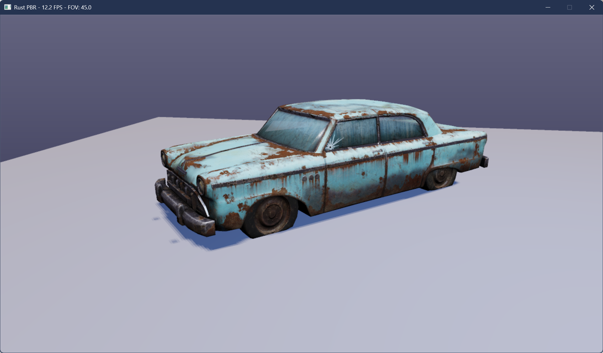
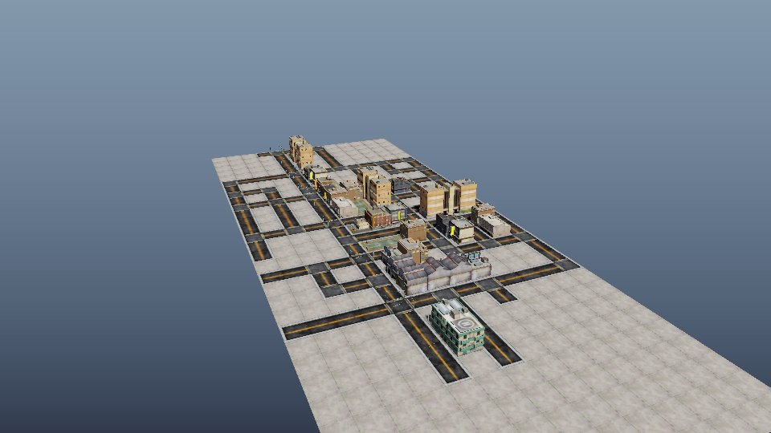

# Rust PBR Rasterizer

A high-performance, multi-threaded software rasterizer built from scratch in Rust. This project implements a modern programmable rendering pipeline featuring Physically Based Rendering (PBR), real-time shadow mapping, and transparent object handling. It supports both high-quality offline image generation and interactive real-time visualization via **minifb**.

[](https://deepwiki.com/Rukkhadevata123/rasterizer-rust)

**Real-time Interactive Mode:**


*Physically Based Rendering with metallic properties, normal mapping, and contact shadows.*


*Textured urban architecture rendered with directional lighting and real-time shadows.*

## Key Features

### Physically Based Rendering (PBR)

- **Workflow:** Standard Metallic-Roughness workflow.
- **BRDF:** Cook-Torrance specular BRDF with Trowbridge-Reitz GGX distribution and Smith Geometry function.
- **Fresnel:** Fresnel-Schlick approximation for realistic light reflection at varying angles.
- **Normal Mapping:** Tangent-space normal mapping with imported or MikkTSpace-generated tangents using the normal texture's selected UV set.
- **Tone Mapping:** ACES Filmic Tone Mapping for cinematic color reproduction.

### Advanced Rendering Capabilities

- **Transparency:** Correct rendering of semi-transparent objects (glass, ice) using back-to-front sorting and alpha blending logic.
- **Shadow Mapping:** Real-time soft shadows using Percentage-Closer Filtering (PCF), adaptive bias, and alpha-tested cutout casters.
- **Anti-Aliasing:** SSAA (Super-Sample Anti-Aliasing) support for smooth edges.
- **Texture Filtering:** glTF UV0/UV1 bindings with repeat, clamp, mirrored-repeat, nearest, linear, and mip-filter sampler semantics.
- **glTF Materials:** Complete core metallic-roughness factors for base color, alpha, metallic, roughness, normals, occlusion, and emissive output. Unsupported `KHR_texture_transform` and `KHR_materials_emissive_strength` inputs fail explicitly.

### High Performance Architecture

- **Massive Parallelism:** Leveraging `Rayon` for triangle preparation, exclusive horizontal-band rasterization, buffer clearing, and post-processing.
- **Thread Safety:** Lock-free safe Rust framebuffer writes through exclusive horizontal-band ownership, keeping depth and color updates consistent.
- **Clipping:** Robust Homogeneous Clip Space clipping (Sutherland–Hodgman) to handle primitives correctly near the camera plane.
- **Optimization:** Data-oriented design with pre-transform optimizations for complex scene sorting.

### Interactive Real-time GUI

- **Windowing:** Lightweight, zero-bloat window management via `minifb`.
- **Camera:** FPS-style free-roam camera with WASD movement and mouse look.
- **Hot Reloading:** Press `R` to reload lights, transforms, render settings, model/texture assets, supersampling buffers, and shadow-map buffers. Window dimensions require a restart.
- **Runtime Tools:** Toggle wireframe modes (`Middle Click`) and cull modes (`Right Click`) on the fly.

## Project Structure

The project follows a clean, modular architecture separating core engine logic from scene management and pipeline definitions.

```text
src
├── core               # The Engine Kernel
│   ├── rasterizer.rs  # Banded rasterization & clipping logic
│   ├── framebuffer.rs # Safe color/depth sample storage and resolve
│   ├── geometry.rs    # Vertex layout & geometric primitives
│   └── math           # Transform factories & interpolation helpers
├── pipeline           # The Rendering Pipeline
│   ├── passes.rs      # High-level Render Passes (Shadow & Main)
│   ├── renderer.rs    # Render orchestrator & clear logic
│   └── shaders        # Programmable PBR & Shadow shaders
├── scene              # Scene Graph & Assets
│   ├── material.rs    # PBR Material & Alpha Mode definitions
│   ├── texture.rs     # Image resources, sampler state, bindings & mipmapping
│   ├── light.rs       # Lighting definitions
│   └── loader.rs      # Resource management & Hot-reloading
├── io                 # File I/O
│   ├── gltf_loader.rs # Robust glTF 2.0 asset importer
│   └── config.rs      # TOML-based scene configuration
└── app.rs             # Application control loops
```

## Getting Started

### Prerequisites

- Rust stable (`Cargo.toml` declares Rust 1.85 as the intended edition-2024 minimum; CI currently validates the runner's active stable toolchain)
- Cargo

### Usage

**1. Real-time GUI Mode (Recommended)**  
Launch the interactive viewer to explore the scene, test lighting, and view PBR materials in real-time.

```bash
cargo run --release -- --config car-scene.toml --gui
```

**2. Offline Rendering (CLI)**  
Render a single high-quality frame to the path configured by `render.output` (`outputs/output_gltf.png` in the example scene).

```bash
cargo run --release -- --config car-scene.toml
```

The published Cargo source package excludes the large demonstration models. Its self-contained smoke scene can be rendered with:

```bash
cargo run --release -- --config benchmarks/fixtures/package-scene.toml
```

**3. Performance Benchmarking**
Measure a configured scene without saving a PNG, or run the complete Phase 8A scenario matrix documented in `benchmarks/README.md`.

```bash
cargo run --release -- --config car-scene.toml --benchmark --benchmark-scenario default-car
node scripts/run-benchmarks.mjs
```

Color triplets in TOML configuration, including backgrounds, ambient light, ground albedo, and light colors, are linear RGB values. Color images used for base color, emissive, and image backgrounds are decoded from sRGB before filtering and shading. Mip generation averages color in linear space, preserves metallic-roughness and occlusion values as raw data, and renormalizes normal maps.

Image decoding is limited to PNG and JPEG, matching the core glTF 2.0 image formats; rendered frames are written as PNG.

## Third-Party Assets

The repository checkout retains two large Sketchfab models for the default scene and benchmark matrix. They are excluded from the Cargo package; their attribution files remain beside the repository assets.

| Asset | Author | License | Use |
|:------|:-------|:--------|:----|
| [Old Rusty Car](https://sketchfab.com/3d-models/old-rusty-car-95baa20ebc5d4d2e869f0b549be838fe) | [Renafox](https://sketchfab.com/kryik1023) | [CC-BY-NC-4.0](assets/licenses/old_rusty_car.txt) | Default scene and car benchmarks; commercial use is prohibited. |
| [CCity Building Set 1](https://sketchfab.com/3d-models/ccity-building-set-1-a2d5c7bfcc2148fb8994864c43dfcc97) | [Neberkenezer](https://sketchfab.com/neberkenezer) | [CC-BY-4.0](assets/licenses/ccity_building_set_1.txt) | City benchmarks. |

The retained [Blue Archive attribution record](assets/licenses/blue_archivekasumizawa_miyu.txt) documents an asset used during development but no longer distributed in the repository.

Directional shadows fit orthographic bounds to the camera frustum and scene geometry; `shadow_ortho_size` caps how far the camera frustum contributes to that fit. `shadow_constant_bias` supplies a base depth offset and `shadow_slope_bias` adds an angle-dependent offset. PCF samples outside the shadow map use a lit border.

The renderer implements direct-light metallic-roughness PBR with a configurable ambient-light approximation. Image-based lighting, including irradiance maps, prefiltered environment reflections, and BRDF lookup tables, is intentionally outside the supported scope.

## Controls (GUI Mode)

| Input                  | Action                                  |
|:-----------------------|:----------------------------------------|
| **W / A / S / D**      | Move Camera                             |
| **Left Click + Mouse** | Look Around                             |
| **Space / L-Shift**    | Move Up / Down                          |
| **Scroll Wheel**       | Adjust FOV (Zoom)                       |
| **R**                  | Reload Configuration (Hot Reload)       |
| **Right Click**         | Cycle Cull Mode (Back -> None -> Front) |
| **Middle Click**       | Toggle Wireframe Mode                   |
| **Esc**                | Exit Application                        |
