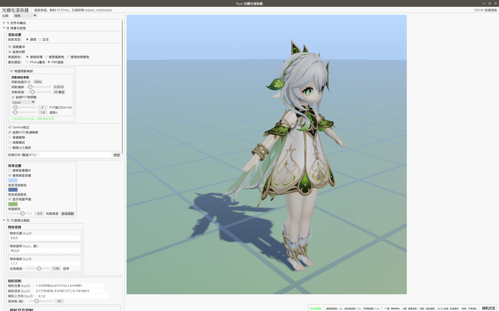
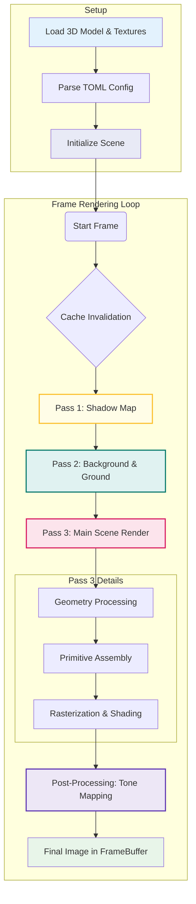
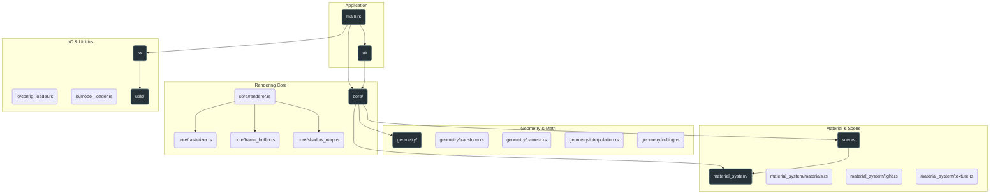

# Software Rasterization Renderer in Rust

A high-performance, multi-threaded 3D software rasterizer **built from scratch** in Rust. This project implements a modern, PBR-correct rendering pipeline, complete with an interactive GUI, a sophisticated caching system, and animation capabilities.

[](https://www.rust-lang.org/)
[](LICENSE)

## Overview

This project is a comprehensive implementation of a 3D graphics pipeline in pure Rust. It's designed for both performance and educational value, demonstrating how modern rendering features can be built without relying on a GPU.

### Key Features

* **Dual Shading Models:** Supports both **Physically Based Rendering (PBR)** using the Cook-Torrance BRDF and the classic **Blinn-Phong** model.
* **Parallel Rasterization:** Employs efficient, triangle-level parallelism using Rayon for high performance on multi-core CPUs.
* **Dynamic Ground & Background:** Features a procedural, infinite ground plane and a skydome/background pass, which are rendered efficiently and separately from the main scene geometry.
* **Shadow Mapping with PCF:** Implements shadow casting for directional lights with optional **Percentage-Closer Filtering (PCF)** for soft, realistic shadow edges. Supports both Box and Gaussian filtering.
* **ACES Tone Mapping:** Integrates the industry-standard ACES filmic tone mapping curve to handle high dynamic range (HDR) colors gracefully, preventing over-exposure and producing cinematic results.
* **Advanced Caching System:** A smart, fine-grained caching mechanism minimizes re-computation during animations, distinguishing between camera movement and object movement to maximize performance.
* **Interactive GUI:** Built with `egui`, allowing for real-time adjustment of all rendering parameters, materials, lighting, and camera controls.
* **Animation & Video Export:** Supports camera and object animations, pre-rendering of frames for smooth playback, and video export via `ffmpeg`.
* **TOML Configuration:** All scene and render settings can be loaded from and saved to human-readable TOML files.



Check our Video Demos:

<https://github.com/user-attachments/assets/1137feff-b93c-450a-a39f-0bac5608b523>

<https://github.com/user-attachments/assets/60182597-fd44-49c1-9c26-b723941626ec>

60 FPS Pre-Rendered Animation:

<https://github.com/user-attachments/assets/ac2b8694-f3bf-46f3-8a0b-bab9a5a35cba>

## Rendering Pipeline

The renderer is architected around a multi-pass process to handle different components of the scene efficiently.



## Project Structure

The project is organized into logical modules, each responsible for a specific part of the rendering pipeline.



## Quick Start

```bash
# Clone the repository
git clone https://github.com/Rukkhadevata123/rasterizer-rust
cd rasterizer-rust

# Run the application with release optimizations
cargo run --release

# To use a specific configuration file
cargo run --release -- -c path/to/your_config.toml
```

## Configuration

All rendering parameters are controlled via a single TOML file. This allows for easy scene setup and sharing. You can check our `complex_config.toml` .

```toml
# Example configuration file (scene.toml)

# --- File paths ---
[files]
obj = "path/to/model.obj"
output = "render_output"
output_dir = "renders"
texture = "path/to/override_texture.png"  # Optional: Overrides textures from MTL
background_image_path = "path/to/background.jpg" # Optional

# --- Core Render Settings ---
[render]
width = 1280
height = 720
projection = "perspective"  # "perspective" or "orthographic"
use_zbuffer = true
use_gamma = true
enable_aces = true           # Enable ACES Filmic Tone Mapping
backface_culling = true
wireframe = false

# --- Camera Setup ---
[camera]
from = "3.0, 2.0, 5.0"   # Position
at = "0.0, 0.5, 0.0"     # Look-at target
up = "0.0, 1.0, 0.0"     # Up vector
fov = 60.0               # Field of view (degrees)

# --- Object Transformation ---
[object]
position = "0, 0, 0"
rotation = "0, 45, 0"    # Rotation in degrees (X, Y, Z)
scale = 1.0              # Uniform scale

# --- Lighting Environment ---
[lighting]
use_lighting = true
ambient = 0.1
ambient_color = "0.1, 0.1, 0.1"

# Define one or more light sources
[[light]]
type = "directional"
enabled = true
direction = "0.5, -1.0, -0.6"
color = "1.0, 0.98, 0.95"
intensity = 1.5

[[light]]
type = "point"
enabled = true
position = "0.0, 3.0, 2.0"
color = "1.0, 0.5, 0.2"
intensity = 5.0

# --- Material Properties (Global Override) ---
[material]
use_pbr = true
use_phong = false
base_color = "0.82, 0.67, 0.16" # Used for PBR Albedo or Phong Diffuse
metallic = 0.1
roughness = 0.4
alpha = 1.0
emissive = "0,0,0"

# --- Shadow Mapping ---
[shadow]
enable_shadow_mapping = true
shadow_map_size = 2048       # Higher values = better quality
shadow_bias = 0.005
enable_pcf = true            # Enable soft shadows
pcf_type = "Gauss"           # "Box" or "Gauss"
pcf_kernel = 2               # PCF sample radius
pcf_sigma = 1.5              # Sigma for Gaussian blur

# --- Background & Ground ---
[background]
enable_gradient_background = true
gradient_top_color = "0.1, 0.2, 0.4"
gradient_bottom_color = "0.7, 0.8, 1.0"
enable_ground_plane = true
ground_plane_color = "0.3, 0.3, 0.3"
ground_plane_height = 0.0

# --- Animation Settings ---
[animation]
animate = false
fps = 30
rotation_speed = 1.0 # Speed multiplier for realtime rendering
rotation_cycles = 1.0 # Number of 360-degree rotations for video export
animation_type = "CameraOrbit" # "CameraOrbit" or "ObjectLocalRotation"
rotation_axis = "Y" # "X", "Y", "Z", or "Custom"
custom_rotation_axis = "0,1,0"
```

## Core Concepts Explained

### Material & Shading System

The material system is designed for flexibility while maintaining a straightforward, unified data structure. Instead of using different structs for different shading models, the project employs a single, monolithic `Material` struct that contains properties for all supported models. An enum, `MaterialType`, acts as a discriminator to control which shading path is executed.

```rust
// The enum to select the shading model
pub enum MaterialType {
    Phong,
    PBR,
}

// A unified struct holding parameters for all models
#[derive(Debug, Clone)]
pub struct Material {
    pub material_type: MaterialType,    // Discriminator field
    pub base_color: Vector3<f32>,       // Shared by PBR (Albedo) and Phong (Diffuse)
    pub alpha: f32,
    pub texture: Option<Texture>,

    // --- PBR-specific parameters ---
    pub metallic: f32,
    pub roughness: f32,
    
    // --- Phong-specific parameters ---
    pub specular: Vector3<f32>,
    pub shininess: f32,
    
    // ... other universal parameters
}
```

This design provides a clear and predictable memory layout. A single dispatch function, `compute_material_response`, inspects the `material_type` field at runtime and seamlessly calculates the correct lighting response based on the active shading model for each mesh. This approach centralizes the shading logic and simplifies the process of applying global material overrides from the UI or configuration files.

### Caching and Performance

To achieve high performance during interactive use and animations, the renderer employs a sophisticated, multi-level caching system for the procedural ground and background.

* **Background Cache:** The sky/background is computed once and cached. It only becomes invalid if background-related settings are changed.
* **Ground Base Cache:** The visual properties of the ground (grid lines, colors, fade-out), which depend on the camera's position and orientation, are cached separately.
* **Ground Shadow Cache:** The shadows cast on the ground are in their own cache.

This fine-grained approach enables smart optimizations:

* **Camera Movement:** Invalidates the ground base and shadow caches, but re-uses the background cache.
* **Object-Only Animation:** Invalidates only the shadow cache, re-using both the background and ground base caches for maximum efficiency.

This is managed by a clean, event-driven invalidation API (`frame_buffer.invalidate_ground_base_cache()`, `frame_buffer.invalidate_ground_shadow_cache()`) that decouples the application logic from the internal caching implementation.

### GUI and Interaction

The application provides a comprehensive GUI for real-time control.

* **Side Panel:** All settings are organized into logical, collapsible sections for easy navigation.
* **Render View:** The central view displays the rendered image.
* **Camera Controls:**
  * **Drag:** Pan the camera.
  * **Shift + Drag:** Orbit the camera around its target.
  * **Scroll Wheel:** Dolly (zoom) the camera forwards and backwards.

## Command-Line Usage

The application can be run in headless mode for batch rendering or integration into scripts.

```bash
# Basic headless render using a config file
cargo run --release -- -c scene.toml --headless

# Use the example config for a quick test
cargo run --release -- --use-example-config
```

## License

This project is licensed under the MIT License. See the [LICENSE](LICENSE) file for details.
